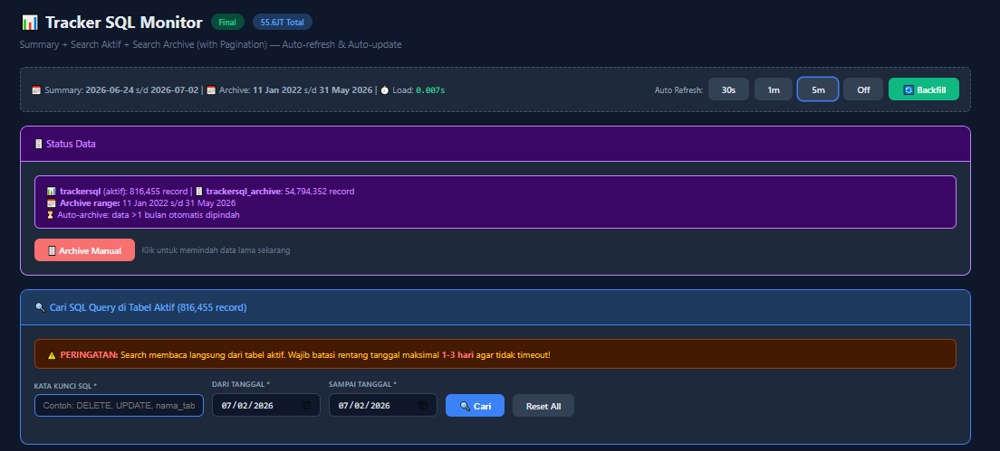
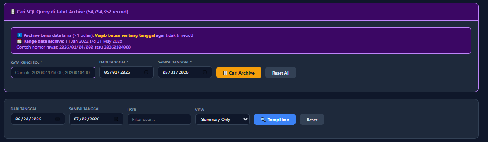
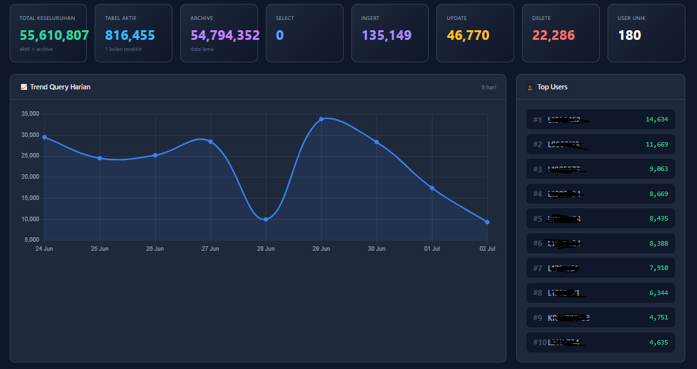

# Aplikasi Tracker SQL Web
Aplikasi Tracker SQL Web ini merupakan alat bantu untuk mengelola data di tabel trackersql SIMKES Khanza.
Seperti yang kita ketahui bahwa log aktifitas adalah mata batin tenaga IT dalam mengawasi sistem. Namun, log aktifitas yang terlalu besar dapat memperlambat kinerja sistem. Oleh karena itu, aplikasi ini dibuat untuk mengelola data di tabel trackersql. Memastikan bahwa trackersql tetap cepat dan efisien.

## 1. Apa Fungsi Aplikasi Ini?
 - Melihat data trackersql
 - Mengupdate summary secara otomatis dan manual
 - Mengarsip data lama
 - Membuat event untuk auto archive

2. Struktur
 - config: koneksi ke DB
 - index: tampilan dashboard
 - update_summary_auto: update summary secara otomatis
 - update_summary_web: update summary dari web
 - archive_safe: arsip data lama
 - debug_search: cek data archive trackersql

3. Petunjuk
 - Pastikan database sudah ada dan table sudah dibuat sesuai dengan sql_query.txt
 - Update config.php sesuai dengan database dan user yang digunakan

Semoga aplikasi ini bermanfaat bagi rekan-rekan IT, khususnya para pengguna SIMKES Khanza.
Terima Kasih.

## Tampilan

### Dashboard

### Pencarian Trackersql

### Update Summary

## UPDATE! 2026-07-03

### Peringatan!
Mohon untuk melakukan backup data trackersql sebelum menggunakan aplikasi ini, agar jika terjadi kesalahan, dapat segera dilakukan restore.
Atau lakukan di server ujicoba atau development terlebih dahulu untuk memastikan bahwa program ini sesuai dengan fungsinya.
Segala resiko ditanggung sendiri (user).
